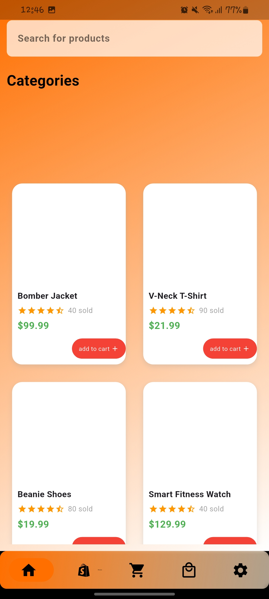
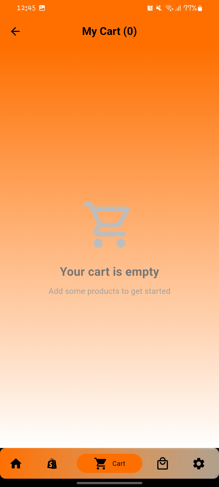
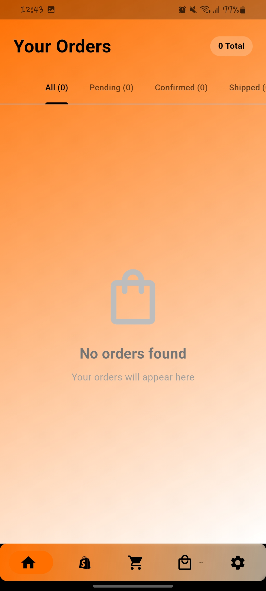

# Gebeya E-Commerce Flutter App

A comprehensive e-commerce application built with Flutter, featuring user authentication, product browsing, shopping cart, order management, and user profile settings. The app is Firebase-ready and uses Provider for state management.

## 🚀 Features

### ✅ Completed Features
- **User Authentication**
  - Email/Password sign up and sign in
  - Google Sign-In integration (Firebase-ready)
  - Guest user mode
  - Password reset functionality
  - Profile management

- **Product Management**
  - Product browsing with categories
  - Search functionality
  - Product cards with images, ratings, and prices
  - Category filtering

- **Shopping Cart**
  - Add/remove products to/from cart
  - Quantity management
  - Real-time cart count badge
  - Cart persistence
  - Total calculation

- **Order Management**
  - Order creation from cart
  - Order status tracking (Pending, Confirmed, Shipped, Delivered, Cancelled)
  - Order history with detailed view
  - Order cancellation for pending orders
  - Tracking number support

- **User Profile & Settings**
  - Profile editing
  - Address management
  - Password change
  - Notification settings
  - Theme preferences
  - Help & support
  - Sign out functionality

- **Navigation**
  - Bottom navigation with 5 tabs
  - Cart badge with real-time updates
  - Smooth page transitions

## 🛠️ Technical Stack

- **Framework**: Flutter
- **State Management**: Provider
- **Backend**: Firebase (Auth, Firestore, Storage)
- **Navigation**: Persistent Bottom Nav Bar
- **UI**: Material Design with custom gradients

## 📱 Screenshots

The app includes:

## 🔧 Setup Instructions

### Prerequisites
- Flutter SDK (3.9.2 or higher)
- Dart SDK
- Android Studio / VS Code
- Firebase account
                           ....                           ....                             .... 
